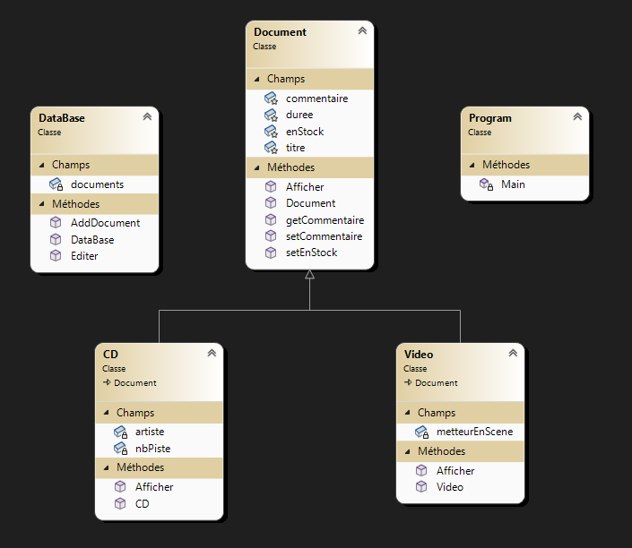
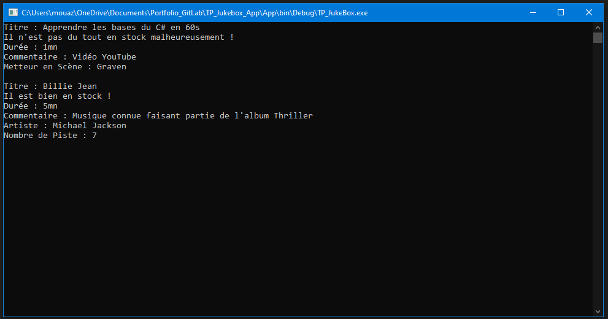

# TP - Jukebox (Héritage/Polymorphisme) ~ Mouaz MOHAMED
Jukebox est une application console en C# avec le framework Microsoft .NET permettant de consulter les stocks des vidéos et des CD

---

## Diagramme de classes
Voici le diagramme de classes de mon application.<br>


---

## Classe Document
Voici le code source de la classe Document.<br>
```csharp
public class Document
{
    protected string titre;
    protected int duree;
    protected bool enStock;
    protected string commentaire;

    public Document(string titre, int duree, bool enStock, string commentaire)
    {
        this.titre = titre;
        this.duree = duree;
        this.enStock = enStock;
        this.commentaire = commentaire;
    }
    public string getCommentaire()
    {
        return this.commentaire;
    }

    public void setCommentaire(string commentaire)
    {
        this.commentaire = commentaire;
    }

    public void setEnStock(bool enStock)
    {
        this.enStock = enStock;
    }

    public virtual void Afficher()
    {
        if(this.enStock==true)
        {
            Console.WriteLine("Titre : {0}",this.titre);
            Console.WriteLine("Il est bien en stock !");
            Console.WriteLine("Durée : {0}mn",this.duree);
            Console.WriteLine("Commentaire : {0}", this.commentaire);
        }
        else
        {
            Console.WriteLine("Titre : {0}", this.titre);
            Console.WriteLine("Il n\'est pas du tout en stock malheureusement !");
            Console.WriteLine("Durée : {0}mn", this.duree);
            Console.WriteLine("Commentaire : {0}", this.commentaire);
        }
    }
}
```

---

## Classe Vidéo
Voici le code source de la classe Vidéo.<br>
``` csharp
class Video : Document
{
    private string metteurEnScene;

    public Video(string titre, int duree, bool enStock, string commentaire, string metteurEnScene):base(titre, duree, enStock, commentaire)
    {
        this.metteurEnScene = metteurEnScene;
    }

    public override void Afficher()
    {
        base.Afficher();
        Console.WriteLine("Metteur en Scène : {0}",this.metteurEnScene);
        Console.WriteLine();
    }
}
```

---

## Classe CD
Voici le code source de la classe CD.<br>
``` csharp
class CD : Document
{
    private string artiste;
    private int nbPiste;

    public CD(string titre, int duree, bool enStock, string commentaire, string artiste, int nbPiste):base(titre,duree,enStock,commentaire)
    {
        this.artiste = artiste;
        this.nbPiste = nbPiste;
    }

    public override void Afficher()
    {
        base.Afficher();
        Console.WriteLine("Artiste : {0}",this.artiste);
        Console.WriteLine("Nombre de Piste : {0}",this.nbPiste);
        Console.WriteLine();
    }
}
```

---

## Classe DataBase
Voici le code source de la classe Database.<br>
``` csharp
public class DataBase
{
    private ArrayList documents;
    public DataBase()
    {
        documents = new ArrayList();
    }
    public void AddDocument(Document d)
    {
        documents.Add(d);
    }
    public void Editer()
    {
        foreach (Document d in documents)
        {
            d.Afficher();
        }
    }
}
```

---

## Programme Main (exemple) et résultat de l'application
Voici le programme Main contenant un exemple, ainsi que le résultat de ce dernier.<br>
```csharp
class Program
{
    static void Main()
    {
        DataBase db = new DataBase();
        Video V = new Video("Apprendre les bases du C# en 60s", 1, false, "Vidéo YouTube", "Graven");
        CD uncD = new CD("Billie Jean", 5, true, "Musique connue faisant partie de l'album Thriller", "Michael Jackson", 7);
        db.AddDocument(V);
        db.AddDocument(uncD);
        db.Editer();
        Console.ReadLine();
    }
}
```
